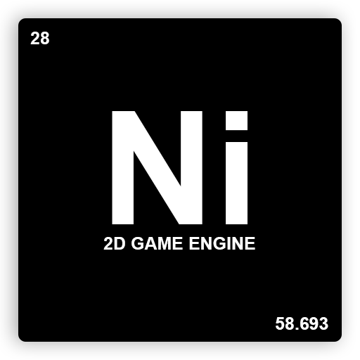

  

## Description
**Ni** *(**N**o **i**dea)* is a small 2D game engine that I created to realize a small group project that my school gave us : a 2D mini game. The engine is based on [WebGL](https://developer.mozilla.org/fr/docs/Web/API/WebGL_API) and have basic functions to make a small 2D game. I decided to write it entirely in [TypeScript](https://www.typescriptlang.org/) for reasons of maintainability, readability and of course for **type !!!**