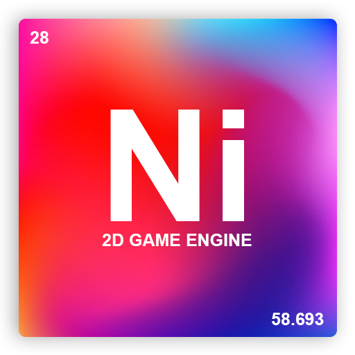

<p align="center">
  
</p>

Sentence of the day :
> 
> *... Thermal vision i see through the bitches ...*
>
> **Thouxanbanfauni**

## Description
**Ni** *(**N**o **i**dea)* is a small 2D game engine that I created to realize a small group project that my school gave us : a 2D mini game. The engine is based on [WebGL](https://developer.mozilla.org/fr/docs/Web/API/WebGL_API) and have basic functions to make a small 2D game. I decided to write it entirely in [TypeScript](https://www.typescriptlang.org/) for reasons of maintainability, readability and of course for **type !!!**

## How to use
First step is to clone this repo :

```bash
git clone https://github.com/5aitama/Ni.git
```
Now go into the cloned folder and install dependencies with :

**Yarn**
```bash
yarn install
```

**NPM**
```bash
npm install
```

Once deps installed, you can run :

**Yarn**
```bash
yarn dev
```

**NPM**
```bash
npm run dev
```

# Exemple

## Ray Marching
Basic implementation of [Ray Marching Algorithm](http://jamie-wong.com/2016/07/15/ray-marching-signed-distance-functions/)

